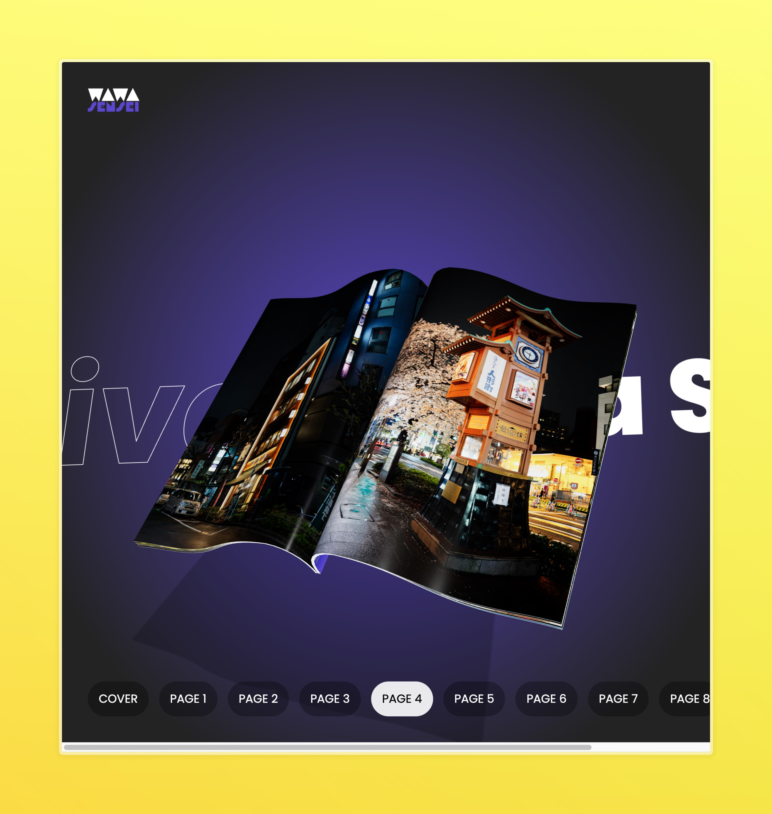

# 📚 3D Book Slider Landing Page ✨




An immersive 3D Book Slider landing page built with Three.js and React Three Fiber, featuring stunning page-turning animations and interactive elements.

## 🌟 Features

- 🎨 Realistic 3D book rendering
- 🔄 Smooth page-turning animations
- 📱 Responsive design
- 🖱️ Interactive user controls
- ⚡ Optimised performance
- 🎭 Custom shader materials

## 🛠️ Technologies Used

- Three.js for 3D rendering
- React Three Fiber for React integration
- TypeScript for type safety
- Vite for development environment
- Custom GLSL shaders
- React Spring for animations

## 🚀 Getting Started

1. Clone the repository:

```bash
git clone https://github.com/pakagronglb/animated-book-slider-threejs.git
```

2. Install dependencies:

```bash
npm install
```

3. Run the development server:

```bash
npm run dev
```

## 📖 Usage

- Click on book corners to turn pages
- Drag to rotate the book view
- Scroll to zoom in/out
- Press ESC to reset view

## 🎯 Implementation Details

- Custom BoxGeometry for page creation
- SkinnedMesh for page-turning animations
- Optimized texture loading
- Custom pointer events handling
- Delayed page transitions for smooth animations

## 🤝 Contributing

Contributions are welcome! Please feel free to submit a Pull Request.

## 📝 License

This project is licensed under the MIT License - see the [LICENSE](LICENSE) file for details.

## 🙏 Credits

This project was inspired by and created following the tutorial by [Wawa Sensei](https://www.youtube.com/watch?v=b7a_Y1Ja6js). Check out their amazing content:

- 🎓 [Complete React Three Fiber Course](https://lessons.wawasensei.dev/course)
- 🌐 [Live Demo](https://r3f-animated-book-slider-final.vercel.app/)
- 💻 [Source Code](https://github.com/wass08/r3f-animated-book-slider)

### 🔗 Useful Resources

- [Squoosh](https://squoosh.app/) - Texture compression
- [Three.js Docs](https://threejs.org/docs/)
- [GraphToy](https://graphtoy.com/)
